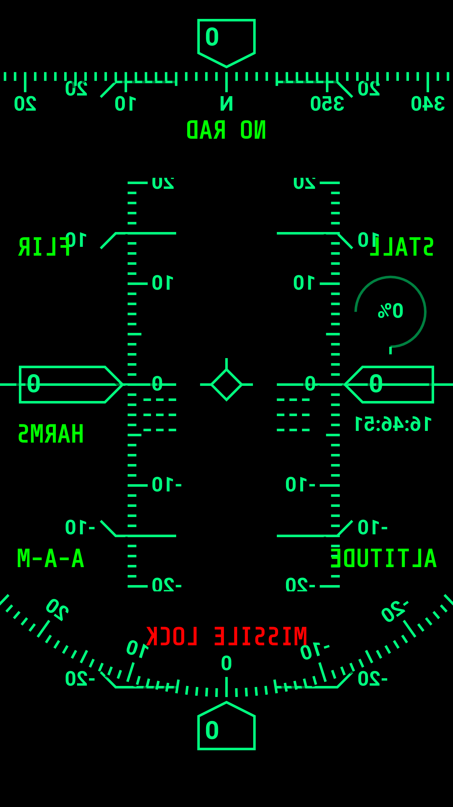
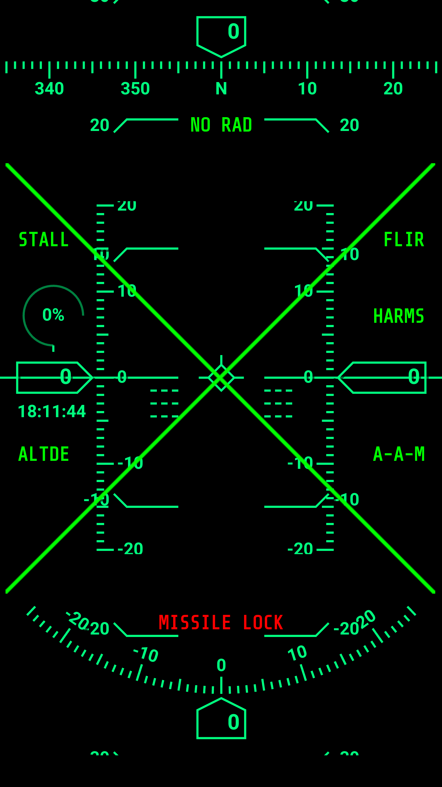
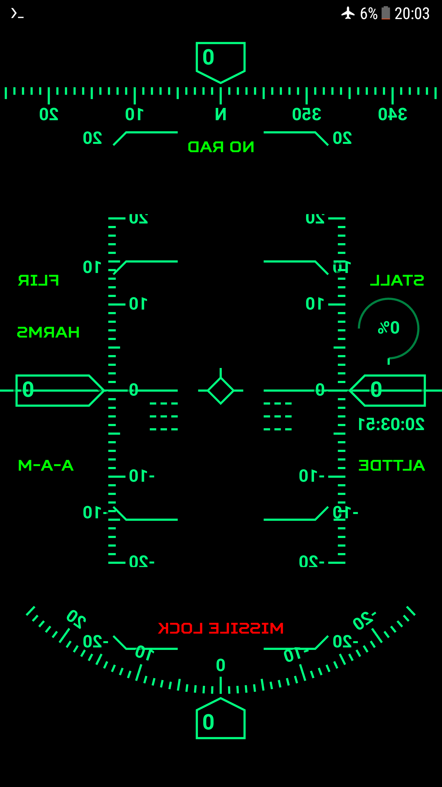
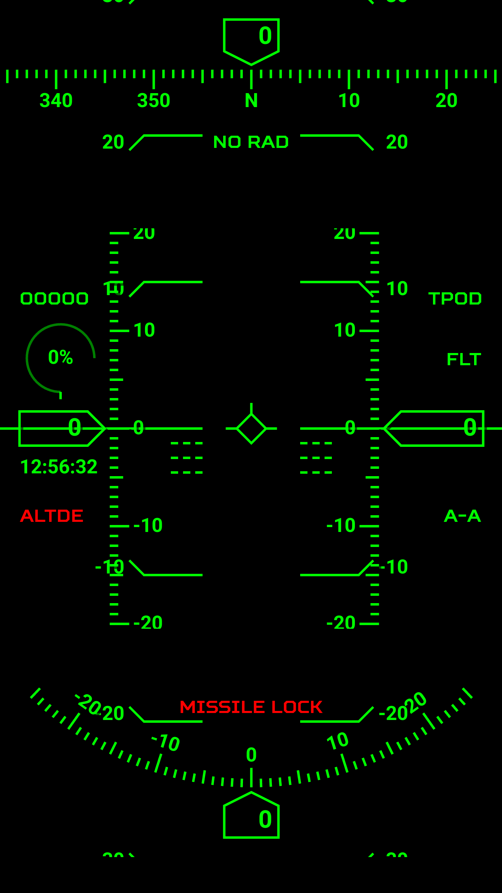

# Android - Heads Up Display using HTML, Javascript and Java (Android)

## Note: You will notice that some of the symbology have different greens because it was experimenting with the color

## Screenshots
|  |  |
|---------------------------------------|---------------------------------------|
|  |  |

## Overview

A side project I worked on how you could try to implement an HUD (Heads Up Display) for a fighter jet.
I ended up using Android, HTML, Javascript and NodeJS to actually link the HUD to a game I was working on

`HUD Video demo` - https://www.youtube.com/watch?v=dxrft8XOl9A&ab_channel=Tendai

## Credit
This project is a fork from https://github.com/SB3NDER/simple-hud

## How it works
The original project is built on HTML and Javascript but to link the project with another system, I had to run the code inside an Android Webview, add a Constrain Layout to display text information as an overlay and then add WebSocket code to request for data from Node server which was receiving the data over UDP
I tried using HTTP for everything but it turned out be slow, like the HUD was sooo janky so using UDP and WebSockets make it smooth (especially the pitch ladder animation)

## Screenshots
You can find images of them in `img` folder
